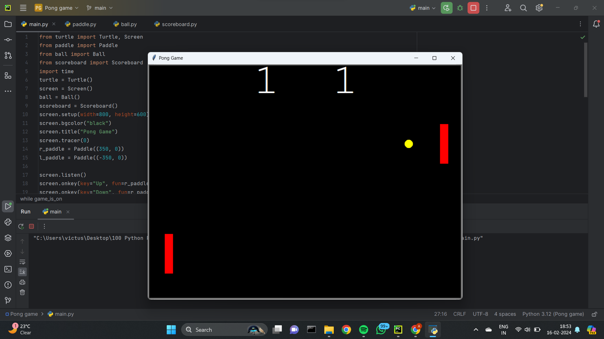

### Following will be the output of our Pong Game code:
#### (displaying the score , two paddles and a ball whose speed gradually increases on every hit and if a paddle misses then the opponent paddle gets a point)
